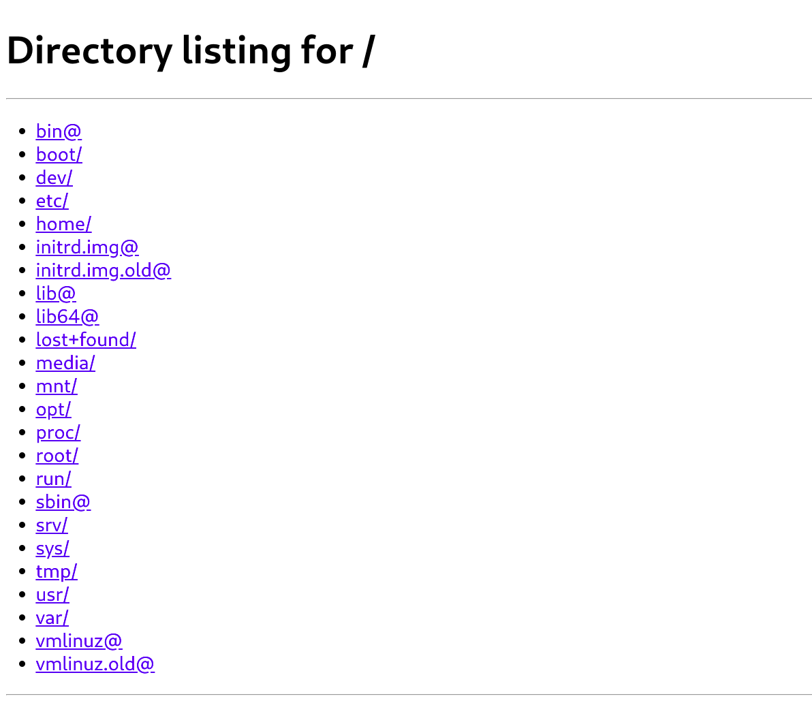
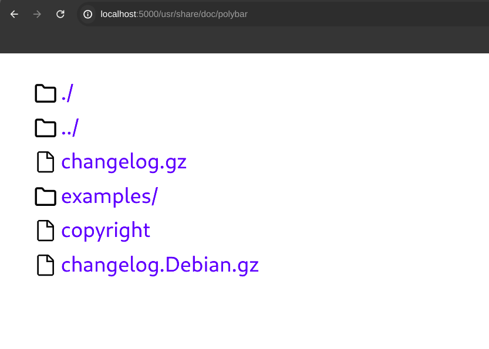

# browser-ui

A web app to browse your server's files.

This flask app can be used can be used to access files over the network (the same wifi) on any device which has access to the network and has a web browser.

This makes it more convinient than setting up other wirless transfer protocols such as ftp, ssh, samba, webdav, etc.

This web app has features such as:

- Nerd Font icons to distinguish fies/directories
- Search through entries
- Respects light/dark mode preference

# About
This project was made as a replacement to the default directory listing when visiting a http server


and make it look like this


# Demo

Video: https://youtu.be/u4Zy3ViEe-8

<iframe width="972" height="547" src="https://www.youtube.com/embed/u4Zy3ViEe-8" title="My CS50x final project - BrowserUI" frameborder="0" allow="accelerometer; autoplay; clipboard-write; encrypted-media; gyroscope; picture-in-picture; web-share" referrerpolicy="strict-origin-when-cross-origin" allowfullscreen></iframe>

# Usage

This project requires Python to be installed.

## Windows

On Windows you can run ```pip install -r requirements.txt```, and then run ```flask run --host=0.0.0.0```

## macOS / Linux

Unix-based systems such as macOS and linux require a virtual evironment to be used, which can be achieved with the below commands.

```
python3 -m venv .venv # creating a virtual environment in .venv/
source .venv/bin/activate # activating the virtual environment
pip install -r requirements.txt # installing dependencies
flask run --host=0.0.0.0 # running the server
```

# Configuration

You can edit the ``BASE_DIR`` variable in ``app.py`` with an _absolute_ path to use as the starting directory or the 'root'.

The default is '/'.

You might need to restart flask if you update the ``BASE_DIR`` variable.

Hot-reloading is possible with the --debug flag.

Enjoy browsing :)
